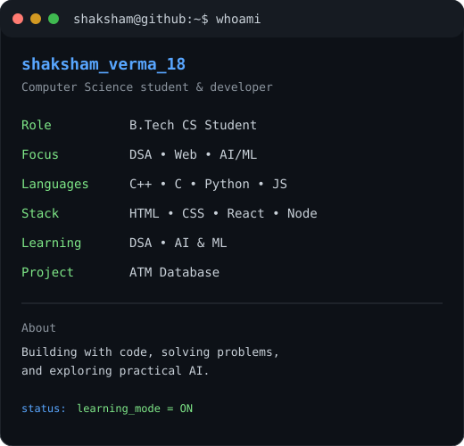

<h3><code>shaksham@github ~ $ ./contributions.sh</code></h3>

  

<h3><code>shaksham@github ~ $ whoami</code></h3>

<table>
<tr>
<td valign="top">

</td>

<td valign="top">

</td>
</tr>
</table>

 

<code>shaksham_verma_18</code> • B.Tech CS Student • DSA • Web Development • AI & ML

  

<a href="https://www.linkedin.com/in/shaksham-verma-93a517389/">
LinkedIn
</a>

&nbsp;•&nbsp;

<a href="https://leetcode.com/u/shaksham_verma_18/">
LeetCode
</a>

&nbsp;•&nbsp;

<a href="mailto:shakshamkverma@gmail.com">
Email
</a>

